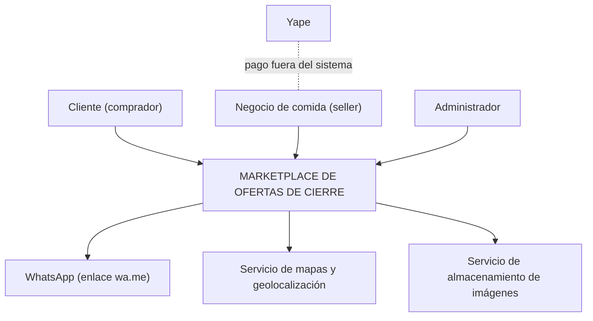

# 01 · Actores

Actores: personas, organizaciones o sistemas externos que están **fuera** del sistema e interactúan con él.

## Diagrama de contexto

## Actores humanos

| Actor | Descripción | ¿Qué necesita realizar? |
|---|---|---|
| **Cliente (comprador)** | Estudiante, trabajador o vecino de Huamanga sensible al precio. Entra desde un link sin registrarse. | Ver las ofertas de cierre del día cerca de él, filtrar por categoría, ver el detalle (precio de carta, descuento, cantidad, hora límite, fecha de vencimiento), pedir por WhatsApp con un código y reportar ofertas engañosas. |
| **Negocio de comida (seller)** | Pollería, panadería o pastelería mediana que tiene producto apto que sobra al cierre del día. | Registrarse y crear su perfil, publicar ofertas del día, editar, pausar o finalizar ofertas, validar los códigos de canje como vendidos y consultar su reporte mensual. |
| **Administrador** | Operador de la plataforma. | Verificar a los negocios (precio de carta con foto), gestionar planes (Gratis/Pro), atender los reportes de los clientes y suspender negocios que incumplan las reglas. |

## Sistemas externos

| Actor | Tipo de relación | ¿Qué hace? |
|---|---|---|
| **WhatsApp** | Integración por enlace (`wa.me`), sin API | Abre el chat con el negocio con un mensaje ya escrito que incluye el código de canje. |
| **Servicio de mapas y geolocalización** | Integración vía API del navegador y de mapas | Obtiene la ubicación aproximada del cliente y muestra las ofertas cercanas. |
| **Servicio de almacenamiento de imágenes** | Integración vía API | Guarda las fotos de las ofertas y la foto del precio de carta usada para verificar el descuento. |
| **Yape** | **Sin integración** (fuera del sistema) | El cliente paga directamente al negocio. El sistema solo muestra el número Yape del negocio. |

> **Decisión de análisis:** a diferencia de GoPet, no hay *pasarela de pago*, *servicio de envío*, *facturación* ni *ERP*. El pago y la entrega ocurren entre el cliente y el negocio. Esto reduce el costo de construcción, pero obliga a rastrear la venta con un código de canje (ver drivers).
