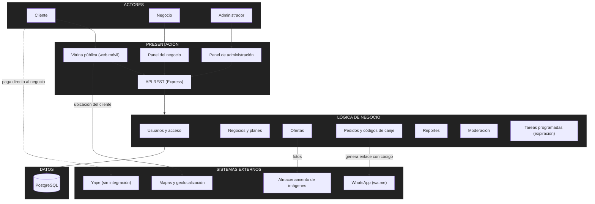
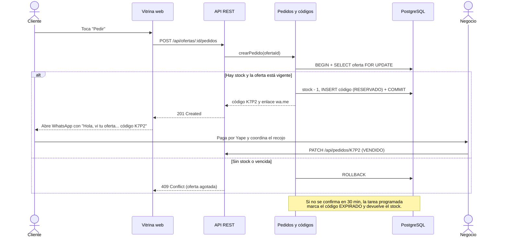
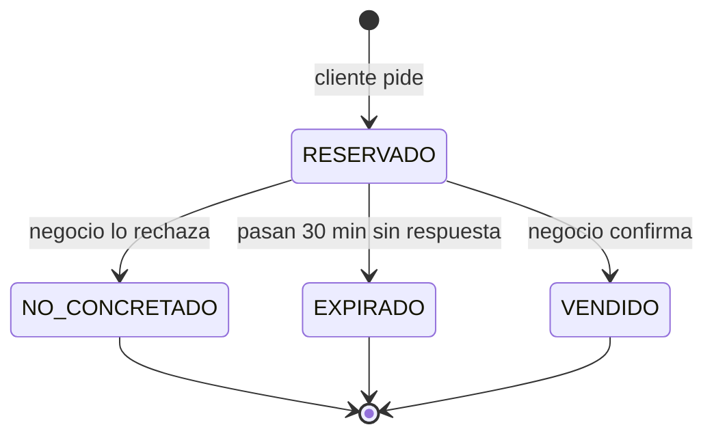

# Arquitectura inicial del sistema

**Estilo:** arquitectura en **tres capas** (presentación, lógica de negocio y datos), con un backend en forma de **monolito modular** en Node.js/Express, que expone una **API REST** y guarda los datos en **PostgreSQL**.

## Diagrama de arquitectura

## Descripción de las capas

| Capa | Pregunta que responde | Componentes |
|---|---|---|
| **Presentación** | ¿Cómo interactúa el usuario? | Vitrina pública (web móvil, sin registro), panel del negocio, panel de administración y la API REST en Express (rutas, controladores y validación de entrada). |
| **Lógica de negocio** | ¿Qué hace el sistema? | Módulos de dominio con sus reglas: usuarios y acceso, negocios y planes, ofertas, pedidos y códigos, reportes, moderación y tareas programadas. |
| **Datos** | ¿Dónde se almacena la información? | PostgreSQL, accedido solo a través de repositorios. Las imágenes viven en un servicio externo; en la base de datos solo se guarda su URL. |

**Regla de dependencia:** cada capa solo llama a la capa inmediatamente inferior. Los controladores no acceden a la base de datos, y los repositorios no contienen reglas de negocio.

## Responsabilidades de los módulos

| Módulo | Responsabilidad | Requisitos | Drivers |
|---|---|---|---|
| **Usuarios y acceso** | Registro e inicio de sesión de negocios y administradores, tokens y control por rol. El cliente navega de forma anónima. | RF17 | DA04 |
| **Negocios y planes** | Perfil del negocio, verificación del precio de carta, ciudad y zona, plan Gratis/Pro y sus límites. | RF07, RF13, RF15 | DA04, DA07 |
| **Ofertas** | Crear, editar, pausar y finalizar ofertas; listado por cercanía y filtros; validar la fecha de vencimiento. | RF01–RF03, RF08–RF10 | DA03, DA05 |
| **Pedidos y códigos de canje** | Generar el código único, reservar el stock en una transacción, construir el enlace `wa.me` y registrar el ciclo de vida del código. | RF04–RF06, RF11 | DA01, DA02, DA06 |
| **Reportes** | Calcular por negocio y por mes los pedidos, las ventas concretadas, la conversión y los clientes nuevos. | RF12 | DA01 |
| **Moderación** | Recibir los reportes de los clientes, resolverlos y suspender negocios. | RF14, RF16 | — |
| **Tareas programadas** | Cada minuto: finalizar las ofertas vencidas o agotadas y liberar las reservas no confirmadas. | RF05, RF10 | DA03 |

## Flujo crítico: pedir una oferta (DA01 + DA02)

## Ciclo de vida del código de canje

## Decisiones iniciales

| Decisión | Alternativa descartada | Motivo |
|---|---|---|
| Tres capas con un monolito modular | Microservicios | Hay un solo desarrollador y el volumen es de una ciudad; los microservicios agregan despliegue y comunicación de red sin beneficio en esta etapa (DA08, RC10). |
| PostgreSQL | Base de datos NoSQL | Las transacciones y el bloqueo de fila garantizan que no haya sobreventa (DA02). |
| WhatsApp por enlace `wa.me` | API de WhatsApp Business | Costo cero y sin trámite de aprobación; es suficiente para el MVP (DA06). |
| Sin pasarela de pago | Integrar Culqi o Niubiz | El pago por Yape ya es un hábito del cliente y evita comisiones y cumplimiento de pagos (RC06). |
| Tarea programada dentro del backend | Servicio o cola independiente | Es simple y basta para el volumen de una ciudad; puede extraerse después si crece (DA03). |

## Integración con sistemas externos
- **Pedidos y códigos → WhatsApp:** el backend construye el enlace `https://wa.me/<número>?text=<mensaje>`; no hay llamadas a una API.
- **Vitrina → Mapas y geolocalización:** el navegador obtiene la ubicación aproximada con permiso del cliente; si no la da, se usa la zona elegida manualmente.
- **Ofertas → Almacenamiento de imágenes:** las fotos se suben a un servicio externo y se sirven comprimidas; en la base de datos solo se guarda la URL.
- **Yape:** no se integra. El pago es entre el cliente y el negocio, y el sistema solo muestra el número Yape del negocio.
