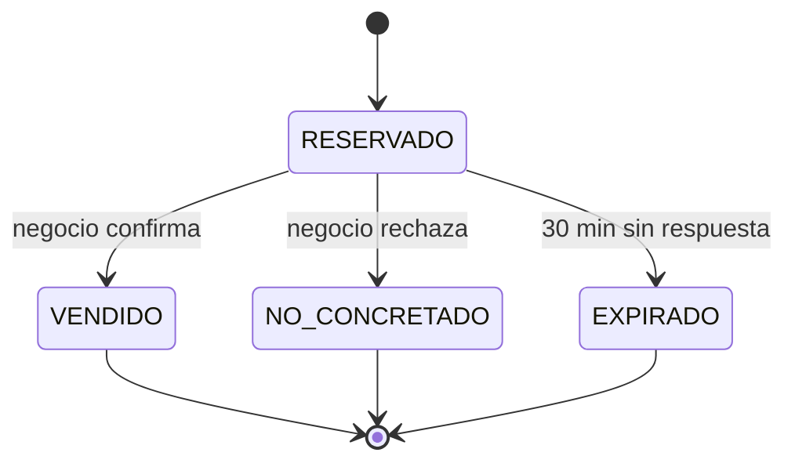

# ADR-004: Código de canje con máquina de estados

- **Estado:** Aceptada
- **Drivers:** DA01 (trazabilidad), AC07

## Contexto
El pedido y el pago ocurren en WhatsApp y Yape, fuera del sistema. Sin un mecanismo propio, la plataforma no puede saber si hubo una venta, y el reporte mensual que justifica el plan Pro ("te llegaron 47 pedidos, 18 de clientes nuevos") no existiría.

## Decisión
Modelar el pedido como la entidad de dominio **`CodigoCanje`**:
- Un código corto, legible y único por día (por ejemplo, `K7P2`), sin caracteres ambiguos (`0/O`, `1/I`).
- Una **máquina de estados** dentro de la entidad, que impide transiciones inválidas:

- Cada cambio de estado guarda la fecha y quién lo hizo (negocio o sistema).
- Opcionalmente se guarda el teléfono del cliente con un hash, para contar "clientes nuevos" sin almacenar el dato en claro.

## Alternativas consideradas
| Alternativa | Por qué se descartó |
|---|---|
| No rastrear (solo contar clics en "Pedir") | No distingue un pedido real de una venta concretada. |
| Pago integrado para registrar la venta | Contradice RC06 y agrega comisiones y fricción. |
| API de WhatsApp Business para leer los chats | Tiene costo y requiere aprobación (RC07). |

## Consecuencias
- ✅ El reporte mensual se calcula con datos reales.
- ✅ La regla vive en el dominio y se prueba sin infraestructura.
- ⚠️ Depende de que el negocio marque el código. Se mitiga con un panel de un solo toque y con la expiración automática (ADR-005).
