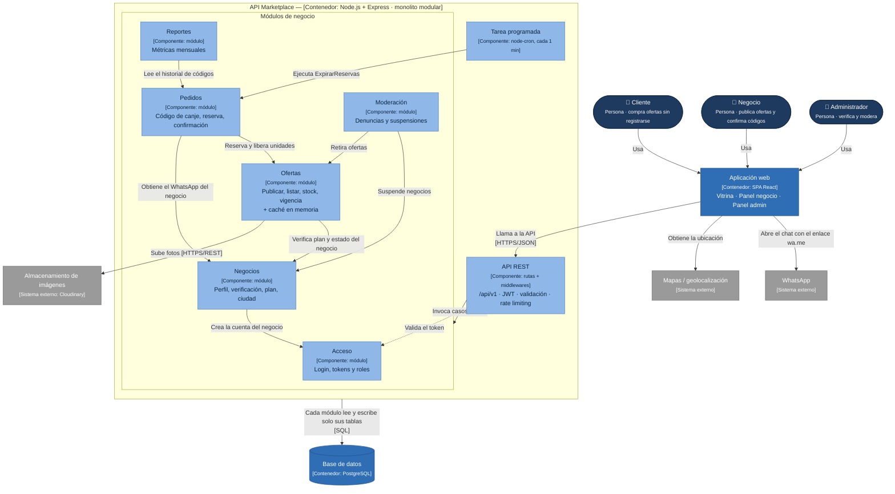

# Componentes arquitectónicos

> Etapa 9: **¿qué componentes existen y cómo se relacionan?**
> Estilo: monolito modular en capas ([ADR-001](decisiones/ADR-001-monolito-modular.md)) · Enfoque interno: Clean Architecture ([ADR-002](decisiones/ADR-002-clean-architecture.md))

## Diagrama de componentes

**Leyenda:** azul oscuro = persona · azul = contenedor · celeste = componente · gris = sistema externo.

**Notas:**
- Cada componente es un módulo del monolito: todos se despliegan juntos.
- Un módulo usa a otro **solo a través de su API pública** (`index.js`), nunca leyendo sus tablas.
- La caché es **en memoria, dentro del módulo Ofertas**, no un contenedor aparte ([ADR-008](decisiones/ADR-008-cache-e-imagenes.md)).
- **Yape** no aparece: el pago ocurre fuera del sistema (RC06).
- El backend **no llama** a WhatsApp: solo construye el enlace `wa.me`, y el navegador del cliente lo abre ([ADR-007](decisiones/ADR-007-integraciones-puertos-adaptadores.md)).

## Responsabilidad de cada componente

| Componente | Responsabilidad | Casos de uso principales | Carpeta en el código |
|---|---|---|---|
| **API REST** | Punto de entrada HTTP: rutas `/api/v1`, autenticación, validación, límite de peticiones y manejo de errores | — | `src/api/` |
| **Acceso** | Identidad y roles (NEGOCIO, ADMIN); el cliente es anónimo | `IniciarSesion`, `RenovarToken` | `src/modulos/acceso/` |
| **Negocios** | Perfil del negocio, verificación del precio de carta, ciudad y zona, plan Gratis/Pro | `RegistrarNegocio`, `VerificarNegocio`, `CambiarPlan` | `src/modulos/negocios/` |
| **Ofertas** | Publicar, editar, pausar y listar ofertas; controlar stock y vigencia | `PublicarOferta`, `ListarOfertasCercanas`, `PausarOferta` | `src/modulos/ofertas/` |
| **Pedidos** | Código de canje, reserva de stock, enlace `wa.me`, confirmación y expiración | `PedirOferta`, `ResolverPedido` (confirmar o rechazar), `ExpirarReservas` | `src/modulos/pedidos/` |
| **Reportes** | Pedidos, ventas, conversión y clientes nuevos por negocio y mes | `GenerarReporteMensual` | `src/modulos/reportes/` |
| **Moderación** | Denuncias de clientes, suspensión de negocios y retiro de ofertas | `ReportarOferta`, `ResolverDenuncia`, `SuspenderNegocio` | `src/modulos/moderacion/` |
| **Tarea programada** | Disparar la expiración cada minuto | — (invoca a Pedidos) | `src/jobs/` |

## Trazabilidad: ¿de qué requisito sale cada componente?

Esta tabla permite responder, para **cualquier caja del diagrama**, por qué existe.

| Componente | Historias de usuario | Requisitos funcionales | Drivers | Decisiones (ADR) | Escenarios de calidad |
|---|---|---|---|---|---|
| **Aplicación web** | HU01–HU13 | RF01–RF03, RF06 | DA05, DA08 | ADR-009 | EQ-01, EQ-05 |
| **API REST** | Todas | RF17 | DA04, DA08 | ADR-001, ADR-006 | EQ-04 |
| **Acceso** | HU06, HU11–HU13 | RF17 | DA04 | ADR-006 | EQ-04 |
| **Negocios** | HU06, HU11, HU12 | RF07, RF13, RF15 | DA04, DA07 | ADR-001 | EQ-08 |
| **Ofertas** | HU01–HU03, HU07, HU08 | RF01–RF03, RF08–RF10, RF13 | DA03, DA05, DA07 | ADR-005, ADR-008 | EQ-01, EQ-06, EQ-08 |
| **Pedidos** | HU04, HU09 | RF04–RF06, RF11 | **DA01, DA02**, DA03, DA06 | **ADR-003, ADR-004**, ADR-005, ADR-007 | **EQ-02**, EQ-06, EQ-07 |
| **Reportes** | HU10 | RF12 | DA01 | ADR-004 | EQ-07 |
| **Moderación** | HU05, HU13 | RF14–RF16 | DA04 | ADR-006 | EQ-04 |
| **Tarea programada** | HU07, HU09 (indirectas) | RF05, RF10 | DA03 | ADR-005 | EQ-06 |
| **PostgreSQL** | — | RF05 | DA02, DA08 | ADR-003 | EQ-02, EQ-07 |
| **Almacenamiento de imágenes** | HU03, HU07, HU11 | RF03, RF08 | DA05, DA06 | ADR-007, ADR-008 | EQ-01 |
| **WhatsApp (enlace)** | HU04 | RF06 | DA06 | ADR-007 | EQ-05, EQ-09 |

**Ejemplo para la exposición:** *"¿Por qué existe el módulo Pedidos separado de Ofertas?"* → Porque la venta ocurre en WhatsApp y hay que rastrearla (DA01, RF04, RF11). Su ciclo de vida, reservado → vendido / no concretado / expirado, es distinto del de la oferta (ADR-004), y es el que abre la transacción concurrente sobre el stock, pidiéndole a Ofertas la reserva a través de su API pública (DA02, ADR-003, EQ-02).
