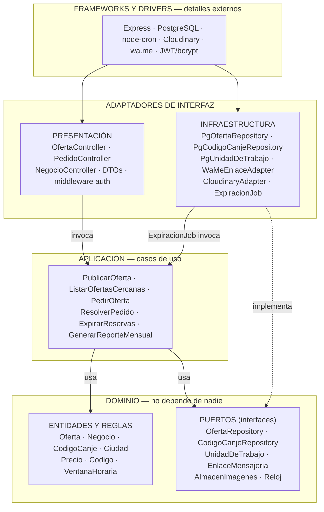
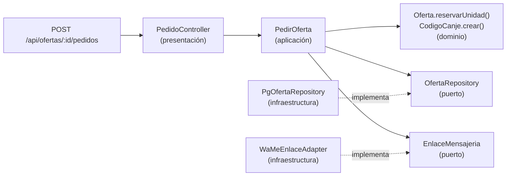

# Enfoque arquitectónico: Clean Architecture

> Etapa 7: **¿qué estructura usamos para organizar las responsabilidades y dependencias internas?** ([ADR-002](decisiones/ADR-002-clean-architecture.md))

| Elemento | Descripción aplicada al Marketplace de Ofertas de Cierre |
|---|---|
| **Patrón / enfoque** | Clean Architecture (Arquitectura Limpia). |
| **Objetivo** | Separar responsabilidades y hacer que todas las dependencias apunten hacia el dominio. |
| **¿Qué problema resuelve?** | Evita que las reglas del negocio (vigencia de la oferta, reserva de stock, estados del código de canje, límites del plan) dependan de Express, PostgreSQL, WhatsApp o del proveedor de imágenes. |
| **Capas definidas** | Dominio, Aplicación, Infraestructura y Presentación. |
| **Beneficios** | • Las reglas se prueban con pruebas unitarias, sin servidor ni base de datos.<br/>• Se puede cambiar `wa.me` por la API de WhatsApp Business, o Cloudinary por otro proveedor, sin tocar los casos de uso.<br/>• Cada módulo crece sin afectar a los demás (DA09). |

## Diagrama de capas y dependencias



**Regla de dependencia:** las flechas apuntan siempre hacia el **dominio**. La infraestructura *implementa* los puertos que el dominio define (inversión de dependencias, la "D" de SOLID). El dominio no importa nada externo.

## Qué vive en cada capa

### Dominio (núcleo)
| Elemento | Regla del negocio que protege |
|---|---|
| `Oferta` | `precioOferta < precioCarta`; no se publica si `fechaVencimiento < hoy`; `stock ≥ 0`; estados ACTIVA → PAUSADA / AGOTADA / FINALIZADA. |
| `Negocio` | El plan Gratis permite 1 oferta al día; un negocio suspendido no publica; se verifica su precio de carta. |
| `CodigoCanje` | Máquina de estados RESERVADO → VENDIDO / NO_CONCRETADO / EXPIRADO; una reserva expira a los 30 min ([ADR-004](decisiones/ADR-004-codigo-de-canje.md)). |
| `Ciudad` | Negocios y ofertas pertenecen a una ciudad (DA07). |
| Puertos | Contratos que la infraestructura debe cumplir. |

### Aplicación (casos de uso)
Orquestan el dominio y los puertos, y no conocen HTTP ni SQL. Ejemplo de **`PedirOferta`**:
1. Abre la unidad de trabajo (transacción).
2. `ofertaRepo.obtenerParaActualizar(id)`, que bloquea la fila.
3. `oferta.reservarUnidad(reloj.ahora())`, que aplica la regla del dominio.
4. `codigo = CodigoCanje.crear(generador.nuevo(), oferta)`.
5. `enlace = mensajeria.generarEnlace(negocio.whatsapp, mensaje)`.
6. Hace el commit y devuelve `{ codigo, enlace }`.

### Infraestructura
Repositorios con `pg`, el adaptador `wa.me`, Cloudinary, JWT, bcrypt, la caché del listado ([ADR-008](decisiones/ADR-008-cache-e-imagenes.md)) y la tarea programada ([ADR-005](decisiones/ADR-005-tareas-programadas.md)).

### Presentación
Rutas y controladores de Express: traducen HTTP ↔ DTO, validan la entrada, llaman al caso de uso y devuelven el código HTTP correspondiente (`201`, `409 oferta agotada`, `403`). También incluye la aplicación web del cliente.

## Flujo de dependencias: pedir una oferta



## Estructura de carpetas propuesta (backend)

```
backend/
├── src/
│   ├── modulos/
│   │   ├── ofertas/
│   │   │   ├── dominio/          # Oferta.js, Precio.js, OfertaRepository.js (puerto)
│   │   │   ├── aplicacion/       # PublicarOferta.js, ListarOfertasCercanas.js
│   │   │   ├── infraestructura/  # PgOfertaRepository.js, CacheOfertaRepository.js
│   │   │   └── presentacion/     # ofertas.routes.js, OfertaController.js, dto/
│   │   ├── pedidos/              # misma estructura (CodigoCanje, PedirOferta, ResolverPedido)
│   │   ├── negocios/
│   │   ├── acceso/
│   │   ├── reportes/
│   │   └── moderacion/
│   ├── compartido/
│   │   ├── dominio/              # Reloj.js, UnidadDeTrabajo.js, errores de dominio
│   │   └── infraestructura/      # db.js (pool pg), WaMeEnlaceAdapter.js, CloudinaryAdapter.js
│   ├── jobs/                     # ExpiracionJob.js (node-cron)
│   ├── config/                   # contenedor de dependencias: conecta puertos con adaptadores
│   ├── app.js                    # Express + middlewares + rutas
│   └── server.js
└── tests/
    └── dominio/                  # pruebas unitarias de las reglas, sin base de datos
```

> **Nota:** la carpeta `config/` es el único lugar donde se decide qué adaptador implementa cada puerto. Cambiar de tecnología se hace allí, sin tocar el dominio ni los casos de uso.
