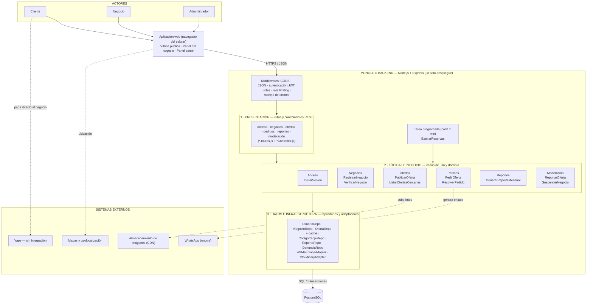

# Estilo arquitectónico

> Etapa 6: **¿cómo estructuramos globalmente el sistema?**

## Estilo seleccionado
**Monolito modular** en estilo **cliente-servidor**, organizado **en capas** y comunicado mediante una **API REST** ([ADR-001](decisiones/ADR-001-monolito-modular.md)).

| Estilo | Cómo se aplica | Driver |
|---|---|---|
| **Cliente-servidor** | La aplicación web (vitrina pública, panel del negocio y panel de administración) corre en el navegador y consume el backend por HTTPS/JSON. | DA08, RC01, RC03 |
| **Monolito modular** | Un solo backend Node.js + Express, dividido en 6 módulos con límites claros. Un solo despliegue y una sola base de datos. | DA07, DA09, RC10 |
| **En capas** | Cada módulo tiene presentación, lógica de negocio (aplicación y dominio) y datos (infraestructura). La organización interna sigue Clean Architecture (ver [enfoque-arquitectonico.md](enfoque-arquitectonico.md)). | DA09 |

### ¿Por qué no otros estilos?
| Estilo | Evaluación |
|---|---|
| Microservicios | Demasiada operación para un solo desarrollador y una ciudad. Los módulos están listos para extraerse si hiciera falta. |
| Event-driven | No hay flujos asíncronos complejos; la única tarea en segundo plano es la expiración (ADR-005). |
| Serverless | Complica las transacciones con bloqueo (ADR-003) y las tareas programadas. |
| SOA | Está pensado para integrar sistemas empresariales; aquí no hay un ERP ni sistemas heredados. |

## Diagrama de arquitectura

**Leyenda:** las flechas continuas indican llamadas dentro del sistema, en una sola dirección hacia abajo. Las flechas punteadas indican integraciones externas.

## Componentes principales

| Componente | Responsabilidad |
|---|---|
| Aplicación web | Interfaz móvil del cliente y paneles del negocio y del administrador; consume la API REST. |
| Middlewares | Aspectos transversales: autenticación, roles, límite de peticiones, validación y errores. |
| Módulo **Acceso** | Inicio de sesión, tokens y roles. |
| Módulo **Negocios** | Perfil, verificación, ciudad y zona, plan Gratis/Pro. |
| Módulo **Ofertas** | Publicación, edición, listado por cercanía y vigencia. |
| Módulo **Pedidos** | Código de canje, reserva de stock, enlace a WhatsApp y confirmación de la venta. |
| Módulo **Reportes** | Métricas mensuales por negocio. |
| Módulo **Moderación** | Denuncias de clientes y suspensión de negocios. |
| Tarea programada | Expira ofertas y libera reservas vencidas. |
| PostgreSQL | Fuente única de datos, con transacciones. |

## Reglas de la arquitectura
1. Cada capa solo llama a la capa inmediatamente inferior.
2. Un módulo no lee las tablas de otro: usa sus casos de uso.
3. La comunicación con el exterior pasa por adaptadores ([ADR-007](decisiones/ADR-007-integraciones-puertos-adaptadores.md)).
4. Toda operación que cambia el stock se ejecuta en una transacción ([ADR-003](decisiones/ADR-003-postgresql-transacciones.md)).
