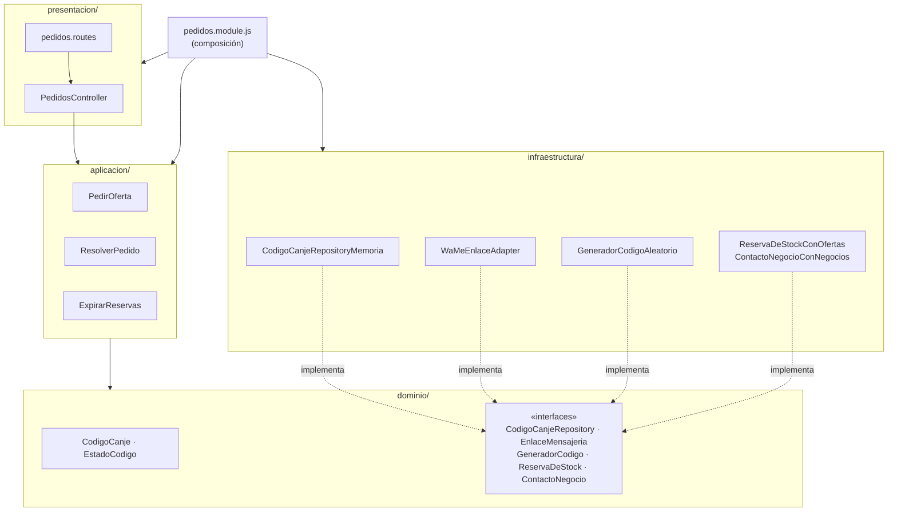
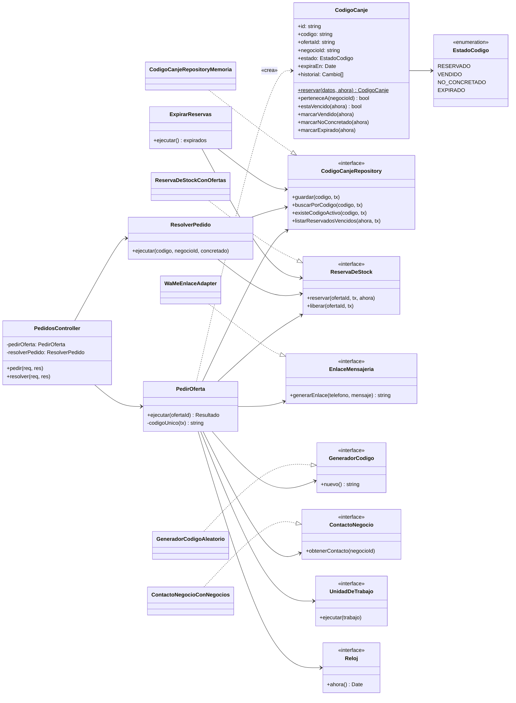
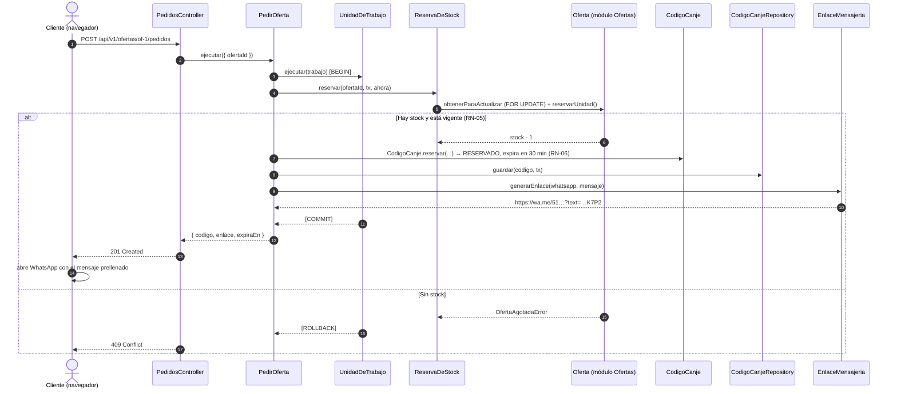

# Diseño interno de módulos

> **Proyecto:** Marketplace de Ofertas de Cierre · **Backend:** Node.js + Express (JavaScript, ES Modules)
> **Enfoque:** Clean Architecture dentro de cada módulo del monolito modular · **Módulo de referencia:** Pedidos
> **Nivel C4:** 4 – Código · **Código ejecutable:** [`tecnologia/ejemplo-clean-architecture/`](../../../tecnologia/ejemplo-clean-architecture/README.md)

---

## 1. Propósito

Este documento describe **cómo se organiza el código dentro de un módulo**. Tiene tres objetivos:
- que todos los módulos se construyan con la misma estructura;
- que las reglas del negocio queden aisladas de la tecnología;
- que cualquier persona del equipo sepa dónde va cada archivo y de qué puede depender.

Se toma **Pedidos** como módulo de referencia porque concentra los drivers más fuertes: trazabilidad (DA01), concurrencia sobre el stock (DA02), expiración (DA03) e integración con WhatsApp (DA06).

---

## 2. Reglas de negocio

Son las reglas que viven en el **dominio**. Cada una tiene su prueba automática en `tests/dominio.test.js` o `tests/pedidos.test.js`.

| ID | Regla | Entidad que la protege |
|---|---|---|
| RN-01 | El precio de oferta debe ser menor que el precio de carta | `Oferta.publicar()` |
| RN-02 | No se publica un producto vencido (la fecha se evalúa con el calendario de Lima) | `Oferta.publicar()` |
| RN-03 | La hora límite debe ser futura y la oferta debe tener al menos 1 unidad | `Oferta.publicar()` |
| RN-04 | El plan Gratis permite 1 oferta por día; el plan Pro, ilimitadas | `Negocio` (módulo Negocios) |
| RN-05 | Solo se reserva una unidad si la oferta está ACTIVA, vigente y con stock | `Oferta.reservarUnidad()` |
| RN-06 | Una reserva vence a los 30 minutos | `CodigoCanje.reservar()` / `estaVencido()` |
| RN-07 | Un código solo sale del estado RESERVADO, y una sola vez | `CodigoCanje.#transicion()` |
| RN-08 | Un código NO_CONCRETADO o EXPIRADO devuelve su unidad al stock | `Oferta.liberarUnidad()` |
| RN-09 | Un negocio suspendido no publica ni recibe pedidos | `Negocio` (módulo Negocios) |
| RN-10 | Un negocio solo opera sobre sus propias ofertas y códigos | `CodigoCanje.perteneceA()` |

---

## 3. Estructura de carpetas

```text
src/
├── compartido/
│   ├── dominio/
│   │   ├── errores.js                     Errores del dominio (sin HTTP)
│   │   ├── puertos.js                     Reloj, UnidadDeTrabajo
│   │   └── fechas.js                      Fecha de calendario en zona Lima
│   └── infraestructura/
│       ├── relojes.js                     RelojSistema, RelojFijo (pruebas)
│       ├── unidad-de-trabajo-memoria.js   Transacción simulada
│       └── unidad-de-trabajo-pg.js        BEGIN / COMMIT / ROLLBACK
└── modulos/
    ├── ofertas/
    │   ├── dominio/oferta.js              Entidad Oferta + EstadoOferta
    │   ├── dominio/oferta-repository.js   Puerto de persistencia
    │   ├── infraestructura/…              Memoria y PostgreSQL (FOR UPDATE)
    │   └── index.js                       API pública: reservarUnidad, liberarUnidad
    └── pedidos/
        ├── dominio/
        │   ├── codigo-canje.js            Entidad CodigoCanje + EstadoCodigo
        │   └── puertos.js                 CodigoCanjeRepository, EnlaceMensajeria,
        │                                  GeneradorCodigo, ReservaDeStock, ContactoNegocio
        ├── aplicacion/
        │   ├── pedir-oferta.caso-uso.js
        │   ├── resolver-pedido.caso-uso.js
        │   └── expirar-reservas.caso-uso.js
        ├── infraestructura/
        │   ├── codigo-canje-repository-memoria.js
        │   ├── wame-enlace.adapter.js
        │   ├── generador-codigo-aleatorio.js
        │   └── modulos-vecinos.adapters.js   Traduce a la API pública de Ofertas y Negocios
        ├── presentacion/
        │   ├── pedidos.controller.js
        │   └── pedidos.routes.js
        └── pedidos.module.js              Raíz de composición
```

| Archivo | Capa | Responsabilidad | Importa de |
|---|---|---|---|
| `codigo-canje.js` | Dominio | Crear el código, controlar sus estados y su vencimiento | Solo dominio |
| `puertos.js` (pedidos) | Dominio | Declarar **qué** necesita Pedidos del exterior | Nada |
| `pedir-oferta.caso-uso.js` | Aplicación | Coordinar reserva → código → enlace en una transacción | Dominio |
| `resolver-pedido.caso-uso.js` | Aplicación | Confirmar o rechazar un código; devolver el stock si no se concretó | Dominio |
| `expirar-reservas.caso-uso.js` | Aplicación | Expirar las reservas de más de 30 minutos | Dominio |
| `codigo-canje-repository-memoria.js` | Infraestructura | Guardar y leer códigos | Dominio |
| `wame-enlace.adapter.js` | Infraestructura | Construir la URL `wa.me` | Dominio |
| `modulos-vecinos.adapters.js` | Infraestructura | Conectar los puertos de Pedidos con la API pública de Ofertas y Negocios | Dominio |
| `pedidos.controller.js` | Presentación | HTTP ⇄ caso de uso | Aplicación (por inyección) |
| `pedidos.module.js` | Composición | Elegir las implementaciones concretas y conectarlas | Todas |

---

## 4. Capas del módulo y regla de dependencia



**Regla de dependencia:** el código solo importa hacia el centro (el dominio). El dominio no conoce Express, PostgreSQL ni WhatsApp.

| Capa | Contiene | Puede depender de | **No** puede depender de |
|---|---|---|---|
| **Dominio** | Entidades, estados, errores, puertos | Nada externo | Aplicación, infraestructura, presentación, Express, `pg` |
| **Aplicación** | Casos de uso | Dominio | Infraestructura, presentación, Express, `pg` |
| **Infraestructura** | Repositorios, adaptadores | Dominio, librerías externas | Aplicación, presentación |
| **Presentación** | Controladores, rutas | Aplicación | Infraestructura, base de datos |
| **Composición** | `pedidos.module.js` | Todas | — |

> **Se comprueba automáticamente:** `tests/arquitectura.test.js` revisa los `import` de `dominio/` y `aplicacion/` y falla si aparece `express`, `pg` o un archivo de infraestructura (EQ-09).

---

## 5. Diagrama de clases



### Notación UML utilizada

| Símbolo | Significado | Ejemplo |
|---|---|---|
| Línea continua con flecha | Asociación: la clase guarda una referencia | `PedirOferta` → `EnlaceMensajeria` |
| Línea discontinua con flecha | Dependencia: la usa o la crea, sin guardarla | `PedirOferta` «crea» `CodigoCanje` |
| Línea discontinua con triángulo hueco | Realización: implementa una interfaz | `WaMeEnlaceAdapter` ▷ `EnlaceMensajeria` |
| «interface» / «enumeration» | Contrato sin implementación / lista de valores | `ReservaDeStock`, `EstadoCodigo` |
| `+` / `-` / `$` | Público / privado / estático | `+reservar()$` |

---

## 6. Flujo de ejecución: pedir una oferta



| Paso | Origen → destino | Acción | Capa |
|---|---|---|---|
| 1–2 | Cliente → Controller → Caso de uso | `POST` sin cuerpo; el cliente es anónimo | Presentación → Aplicación |
| 3 | Caso de uso → UnidadDeTrabajo | Abre la transacción | Aplicación → Dominio (puerto) |
| 4–5 | ReservaDeStock → Ofertas | Bloquea la fila y descuenta 1 unidad (RN-05) | Infraestructura → API pública de Ofertas |
| 6 | Caso de uso → `CodigoCanje` | Crea el código RESERVADO con vencimiento (RN-06) | Aplicación → Dominio |
| 7 | Caso de uso → Repositorio | Guarda el código dentro de la transacción | Aplicación → Dominio (puerto) |
| 8–9 | Caso de uso → EnlaceMensajeria | Arma la URL `wa.me` con el código | Aplicación → Dominio (puerto) |
| 10 | UnidadDeTrabajo | `COMMIT`: el stock y el código se confirman juntos | Infraestructura |
| 11–12 | Controller → Cliente | `201` con `codigo`, `enlace` y `expiraEn` | Presentación |
| Alt. | Sin stock | `ROLLBACK`; nada se modifica; `409 Oferta agotada` | Dominio → Presentación |

---

## 7. Código de referencia

El código completo y probado está en [`tecnologia/ejemplo-clean-architecture/`](../../../tecnologia/ejemplo-clean-architecture/README.md). Fragmentos clave:

### 7.1 Dominio: la entidad protege sus reglas

```js
// pedidos/dominio/codigo-canje.js
static reservar({ id, codigo, ofertaId, negocioId }, ahora) {
  const expiraEn = new Date(ahora.getTime() + MINUTOS_RESERVA * 60_000);   // RN-06
  return new CodigoCanje({ id, codigo, ofertaId, negocioId,
    estado: EstadoCodigo.RESERVADO, creadoEn: ahora, expiraEn,
    historial: [{ estado: EstadoCodigo.RESERVADO, fecha: ahora.toISOString(), actor: 'CLIENTE' }] });
}

#transicion(nuevoEstado, ahora, actor) {                                    // RN-07
  if (this.estado !== EstadoCodigo.RESERVADO) {
    throw new ReglaNegocioError(`RN-07: el código ${this.codigo} ya está ${this.estado}`);
  }
  this.estado = nuevoEstado;
  this.historial.push({ estado: nuevoEstado, fecha: ahora.toISOString(), actor });
}
```

### 7.2 Aplicación: el caso de uso solo conoce puertos

```js
// pedidos/aplicacion/pedir-oferta.caso-uso.js
async ejecutar({ ofertaId }) {
  return this.unidadDeTrabajo.ejecutar(async (tx) => {
    const ahora = this.reloj.ahora();
    const reserva = await this.reservaDeStock.reservar(ofertaId, tx, ahora);   // puerto, no Ofertas
    const codigo = await this.#codigoUnico(tx);
    const codigoCanje = CodigoCanje.reservar({ id: randomUUID(), codigo, ofertaId, negocioId: reserva.negocioId }, ahora);
    await this.codigos.guardar(codigoCanje, tx);                               // puerto, no PostgreSQL
    const contacto = await this.contactoNegocio.obtenerContacto(reserva.negocioId);
    const mensaje = `Hola ${contacto.nombre}, vi tu oferta "${reserva.titulo}"… Mi código es ${codigo}.`;
    const enlace = this.mensajeria.generarEnlace(contacto.whatsapp, mensaje);  // puerto, no wa.me
    return { codigo, enlace, expiraEn: codigoCanje.expiraEn.toISOString() };
  });
}
```

### 7.3 Infraestructura: el adaptador traduce al proveedor

```js
// pedidos/infraestructura/wame-enlace.adapter.js
export class WaMeEnlaceAdapter extends EnlaceMensajeria {
  generarEnlace(telefono, mensaje) {
    const soloDigitos = String(telefono).replace(/\D/g, '');
    return `https://wa.me/${soloDigitos}?text=${encodeURIComponent(mensaje)}`;
  }
}
```

### 7.4 Composición: el único lugar que elige implementaciones

```js
// pedidos/pedidos.module.js
const pedirOferta = new PedirOferta({
  ...dependencias,
  generadorCodigo: new GeneradorCodigoAleatorio(),
  contactoNegocio: new ContactoNegocioConNegocios(apiNegocios),
  mensajeria: new WaMeEnlaceAdapter(),   // ← cambiar a WhatsApp Business = cambiar esta línea
});
```

---

## 8. Comunicación entre módulos

Pedidos **no** importa las clases de Ofertas ni lee su tabla. Usa su **API pública** (`ofertas/index.js`) a través de un adaptador propio (`ReservaDeStockConOfertas`). Ambos módulos comparten la **misma transacción** (`tx`) porque viven en el mismo proceso y en la misma base de datos (ADR-001). Si algún día Ofertas se separa como servicio, solo cambia ese adaptador.
