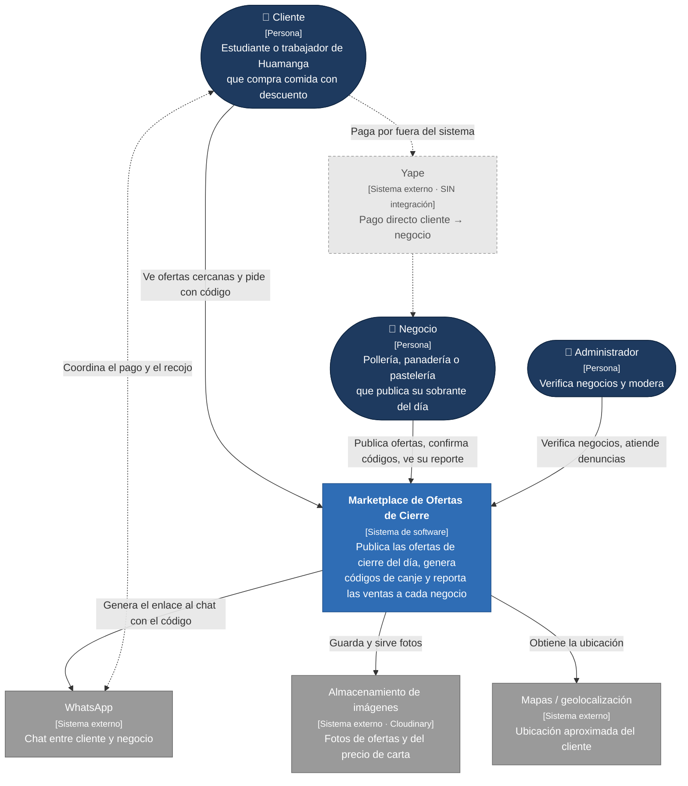

# Nivel 1 · Diagrama de contexto del sistema

> **Proyecto:** Marketplace de Ofertas de Cierre
> **Modelo:** C4 · Nivel 1 de 4 · **Versión:** 1.0

---

## 1. Objetivo

Mostrar el **Marketplace de Ofertas de Cierre como una sola caja**: quiénes lo usan y con qué sistemas externos se relaciona. Es la vista de mayor nivel y la primera que se presenta a cualquier persona, técnica o no.

| Aspecto | Descripción |
|---|---|
| Pregunta que responde | ¿Qué es el sistema, quién lo usa y con quién se integra? |
| Audiencia | Todos: negocios, docentes, incubadora, equipo de desarrollo |
| Qué **no** muestra | Tecnologías, servidores, bases de datos ni módulos internos |
| Siguiente nivel | [`Nivel2-DiagramadeContenedores.md`](Nivel2-DiagramadeContenedores.md) |

---

## 2. Diagrama

**Leyenda:** azul oscuro = persona · azul = sistema en alcance · gris = sistema externo · gris claro punteado = fuera del sistema (sin integración).

---

## 3. Personas (usuarios)

| Persona | Descripción | Qué hace en el sistema |
|---|---|---|
| **Cliente** | Estudiante de la UNSCH, trabajador o vecino de Huamanga; sensible al precio; entra desde el celular | Ve las ofertas vigentes cerca de él, pide una oferta (recibe un código y un enlace a WhatsApp), reporta ofertas engañosas. **No se registra** |
| **Negocio** | Pollería, panadería o pastelería mediana con producto que sobra al cierre | Publica ofertas con foto, precio de carta y hora límite; confirma o rechaza códigos; consulta su reporte mensual |
| **Administrador** | Operador de la plataforma | Verifica negocios y su precio de carta, gestiona planes, atiende denuncias y suspende negocios |

---

## 4. Sistemas

| Sistema | Tipo | Responsabilidad | Quién lo construye |
|---|---|---|---|
| **Marketplace de Ofertas de Cierre** | Sistema en alcance | Reunir las ofertas de cierre de la ciudad, generar códigos de canje y medir las ventas | El equipo del proyecto |
| **WhatsApp** | Sistema externo | Canal donde cliente y negocio coordinan el pago y el recojo | Meta |
| **Almacenamiento de imágenes** | Sistema externo | Guardar, comprimir y servir las fotos | Proveedor (Cloudinary) |
| **Mapas / geolocalización** | Sistema externo | Ubicación aproximada del cliente para ordenar por cercanía | Navegador + proveedor de mapas |
| **Yape** | Fuera del sistema | El cliente paga directamente al negocio | BCP (sin integración) |

---

## 5. Relaciones

| Origen | Destino | Descripción | Protocolo |
|---|---|---|---|
| Cliente | Marketplace | Consulta ofertas y pide con código | — |
| Negocio | Marketplace | Publica ofertas, confirma códigos y consulta reportes | — |
| Administrador | Marketplace | Verifica y modera | — |
| Marketplace | WhatsApp | Genera el enlace `wa.me` con el mensaje y el código (no hay llamada de red) | URL |
| Marketplace | Almacenamiento de imágenes | Sube y sirve fotos | HTTPS/REST |
| Marketplace | Mapas | Obtiene la ubicación con permiso del cliente | API del navegador |
| Cliente ⇄ Negocio | WhatsApp / Yape | Coordinan y pagan **fuera** del sistema | — |

> En el nivel 1 no se indica el protocolo entre personas y sistema; eso se detalla en el nivel 2.

---

## 6. Decisiones y supuestos

| # | Decisión o supuesto | Motivo | Referencia |
|---|---|---|---|
| 1 | El sistema **no procesa pagos** | Yape ya es el hábito de pago; se evitan comisiones y riesgos de manejar dinero | RC06 |
| 2 | WhatsApp se usa por **enlace**, sin API | Costo cero y sin trámite de aprobación | RC07, ADR-007 |
| 3 | La venta ocurre fuera del sistema y se rastrea con un **código de canje** | Es la única forma de medir ventas sin integrar pagos | DA01, ADR-004 |
| 4 | No hay servicio de envío | El recojo o el delivery los gestiona el propio negocio | Alcance del MVP |

### Pendientes por definir

| Tema | Detalle |
|---|---|
| Alertas al cliente | Las alertas "avísame cuando haya pollo cerca" requerirían un canal de notificación (WhatsApp Business o web push). Fuera del MVP |
| Responsabilidad legal como intermediario | Revisar con un abogado antes del lanzamiento |
