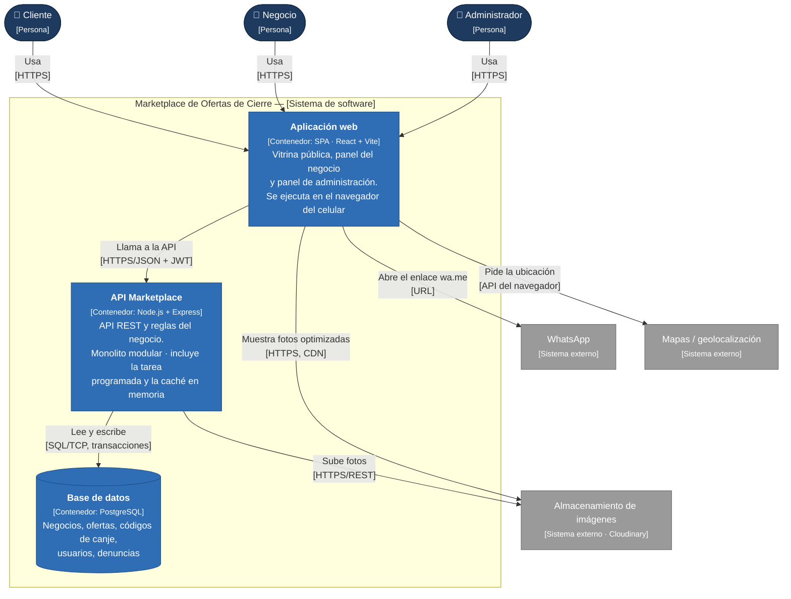

# Nivel 2 · Diagrama de contenedores

> **Proyecto:** Marketplace de Ofertas de Cierre
> **Modelo:** C4 · Nivel 2 de 4 · **Versión:** 1.0

---

## 1. Objetivo

Abrir la caja «Marketplace de Ofertas de Cierre» del nivel 1 y mostrar los **contenedores** que la forman: las aplicaciones y almacenes de datos que se ejecutan por separado, la tecnología de cada uno y cómo se comunican.

| Aspecto | Descripción |
|---|---|
| Pregunta que responde | ¿De qué piezas ejecutables se compone el sistema y con qué tecnología? |
| Audiencia | Arquitectos, desarrolladores, operaciones |
| Qué es un contenedor | Algo que se ejecuta o almacena datos de forma independiente: una aplicación web, una API o una base de datos (no es lo mismo que un contenedor Docker) |
| Nivel anterior | [`Nivel1-DiagramadeContextodelSistema.md`](Nivel1-DiagramadeContextodelSistema.md) |
| Siguiente nivel | [`Nivel3-Diagrama-de-Componentes.md`](Nivel3-Diagrama-de-Componentes.md) |

---

## 2. Diagrama

---

## 3. Contenedores

| Contenedor | Tecnología | Responsabilidad | Datos que maneja |
|---|---|---|---|
| **Aplicación web** | SPA · React + Vite, *mobile-first*, servida desde un CDN | Vitrina de ofertas, pedido con código, panel del negocio y panel de administración | Ninguno persistente; solo el estado de la pantalla y el token de sesión del negocio |
| **API Marketplace** | Node.js 20 + Express · **monolito modular** con Clean Architecture | API REST `/api/v1`, reglas del negocio, transacciones, tarea programada de expiración y caché en memoria del listado | Ninguno propio; usa la base de datos |
| **Base de datos** | PostgreSQL | Almacenamiento permanente con transacciones y restricciones (`CHECK stock >= 0`) | Ciudades, negocios, usuarios, ofertas, códigos de canje y su historial, denuncias |

> **No hay contenedor de caché separado** (como Redis): la caché vive en memoria dentro de la API ([ADR-008](../02-arquitectura-software/decisiones/ADR-008-cache-e-imagenes.md)). Se agregará Redis solo si se ejecutan varias instancias de la API.

---

## 4. Relaciones

| Origen | Destino | Descripción | Protocolo |
|---|---|---|---|
| Cliente, Negocio, Administrador | Aplicación web | Usan la aplicación desde el navegador | HTTPS |
| Aplicación web | API Marketplace | Llama a la API; el negocio envía su token | HTTPS/JSON + JWT |
| API Marketplace | Base de datos | Lee y escribe, con transacciones y `FOR UPDATE` | SQL sobre TCP |
| API Marketplace | Almacenamiento de imágenes | Sube las fotos (credenciales en el servidor) | HTTPS/REST |
| Aplicación web | Almacenamiento de imágenes | Descarga las fotos ya optimizadas (WebP) | HTTPS (CDN) |
| Aplicación web | WhatsApp | Abre el enlace `wa.me` que devolvió la API | URL |
| Aplicación web | Mapas | Obtiene la ubicación con permiso del cliente | API del navegador |

---

## 5. Decisiones arquitectónicas reflejadas

| Decisión | Alternativa descartada | Motivo | ADR |
|---|---|---|---|
| Un único contenedor de backend (monolito modular) | Microservicios | Un solo desarrollador y una ciudad; los módulos permiten separar servicios en el futuro | ADR-001 |
| SPA separada del backend | Páginas generadas en el servidor | El frontend y el backend se despliegan por separado; la interfaz se sirve rápido desde un CDN | ADR-009 |
| PostgreSQL | Base de datos NoSQL | La reserva de stock necesita transacciones y bloqueo de fila | ADR-003 |
| Tarea programada **dentro** de la API | Servicio o cola independiente | Es suficiente para una ciudad; evita operar otro contenedor | ADR-005 |
| Caché en memoria | Redis | Con una sola instancia, Redis solo agrega costo | ADR-008 |
| Solo la API habla con el proveedor de imágenes para subir | Subir desde el navegador con una clave expuesta | Las credenciales quedan en el servidor | ADR-007 |

---

## 6. Seguridad entre contenedores

| Comunicación | Medida |
|---|---|
| Navegador → Aplicación web y API | Tráfico cifrado con HTTPS |
| Aplicación web → API | Token JWT de corta duración para negocio y administrador; el cliente es anónimo con límite de peticiones |
| API → Base de datos | Acceso solo desde la red interna; credenciales en variables de entorno; usuario de base de datos sin permisos de administrador |
| API → Almacenamiento de imágenes | Clave del proveedor guardada solo en el servidor |
