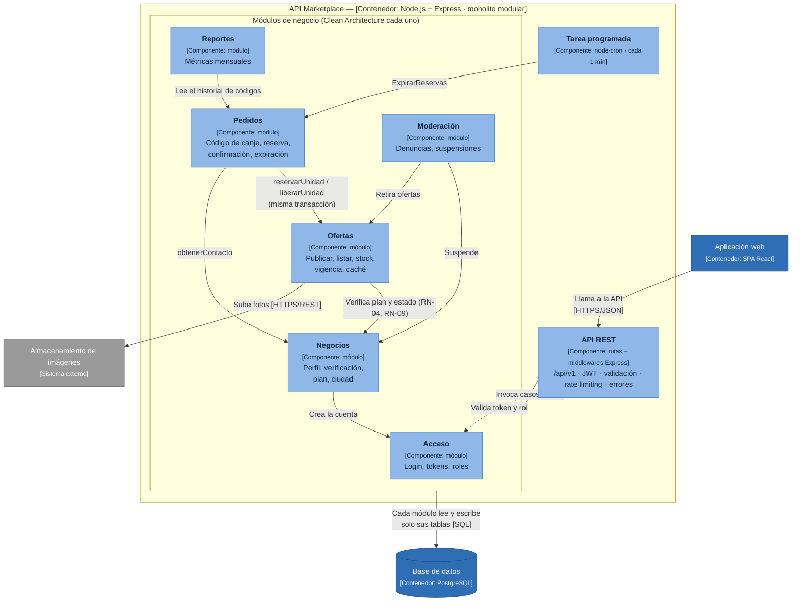

# Nivel 3 · Diagrama de componentes

> **Proyecto:** Marketplace de Ofertas de Cierre · **Contenedor detallado:** API Marketplace
> **Modelo:** C4 · Nivel 3 de 4 · **Versión:** 1.0

---

## 1. Objetivo

Abrir el contenedor **API Marketplace** del nivel 2 y mostrar sus **componentes**: los módulos del monolito modular, la responsabilidad de cada uno y cómo se relacionan entre sí, con la base de datos y con los sistemas externos.

| Aspecto | Descripción |
|---|---|
| Pregunta que responde | ¿Cómo se divide el backend por dentro y qué hace cada parte? |
| Audiencia | Arquitectos y desarrolladores |
| Qué es un componente | Un grupo de funcionalidades con una responsabilidad clara, accesible mediante una interfaz. Aquí, cada **módulo** del monolito es un componente |
| Nivel anterior | [`Nivel2-DiagramadeContenedores.md`](Nivel2-DiagramadeContenedores.md) |
| Siguiente nivel | [`Nivel4-DiagramadeCodigo.md`](Nivel4-DiagramadeCodigo.md) |

---

## 2. Diagrama

**Notas:**
- Todos los componentes se despliegan juntos (un solo proceso).
- Un módulo usa a otro **solo a través de su API pública** (`index.js`), nunca leyendo sus tablas.
- Pedidos y Ofertas comparten la **transacción** al reservar stock: es posible porque están en el mismo proceso y en la misma base de datos (ADR-001, ADR-003).

---

## 3. Componentes

| Componente | Responsabilidad | Funcionalidades principales | Carpeta en el código |
|---|---|---|---|
| **API REST** | Punto de entrada HTTP | Rutas `/api/v1`, autenticación JWT, validación, límite de peticiones, traducción de errores a HTTP | `src/api/` |
| **Acceso** | Identidad y roles | Inicio de sesión, renovación de token, roles NEGOCIO y ADMIN | `src/modulos/acceso/` |
| **Negocios** | Gestión de negocios | Registro, verificación del precio de carta, plan Gratis/Pro, ciudad y zona | `src/modulos/negocios/` |
| **Ofertas** | Ofertas de cierre | Publicar, editar, pausar, listar por cercanía; stock y vigencia; caché del listado | `src/modulos/ofertas/` |
| **Pedidos** | Trazabilidad de la venta | Código de canje, reserva de stock, enlace `wa.me`, confirmación, rechazo y expiración | `src/modulos/pedidos/` |
| **Reportes** | Métricas por negocio | Pedidos, ventas concretadas, conversión y clientes nuevos por mes | `src/modulos/reportes/` |
| **Moderación** | Confianza | Denuncias de clientes, suspensión de negocios y retiro de ofertas | `src/modulos/moderacion/` |
| **Tarea programada** | Expiración automática | Ejecuta `ExpirarReservas` cada minuto | `src/jobs/` |

---

## 4. Relaciones entre componentes

| Origen | Destino | Descripción | Tipo de comunicación |
|---|---|---|---|
| Aplicación web | API REST | Llama a la API | HTTPS/JSON |
| API REST | Módulos de negocio | Invoca los casos de uso | Llamada en memoria |
| API REST | Acceso | Valida el token y el rol en cada petición protegida | Llamada en memoria (middleware) |
| Negocios | Acceso | Crea la cuenta al registrar un negocio | Llamada en memoria (API pública) |
| Ofertas | Negocios | Verifica el plan (1 oferta al día en Gratis) y que el negocio no esté suspendido | Llamada en memoria (API pública) |
| Pedidos | Ofertas | Reserva y libera unidades **dentro de la misma transacción** | Llamada en memoria (API pública + `tx`) |
| Pedidos | Negocios | Obtiene el nombre y el WhatsApp del negocio | Llamada en memoria (API pública) |
| Reportes | Pedidos | Lee el historial de códigos para calcular las métricas | Llamada en memoria (API pública de consulta) |
| Moderación | Negocios / Ofertas | Suspende negocios y retira ofertas | Llamada en memoria (API pública) |
| Tarea programada | Pedidos | Dispara `ExpirarReservas` | Llamada en memoria |
| Módulos | PostgreSQL | Cada módulo accede solo a sus tablas | SQL |
| Ofertas | Almacenamiento de imágenes | Sube las fotos | HTTPS/REST |

---

## 5. Trazabilidad

La matriz completa componente → HU → RF → driver → ADR → escenario de calidad está en [`componentes-arquitectonicos.md`](../02-arquitectura-software/componentes-arquitectonicos.md#trazabilidad-de-qué-requisito-sale-cada-componente).
