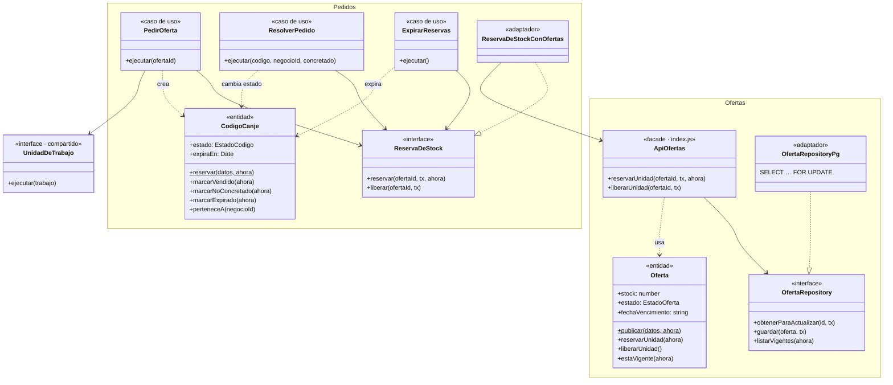
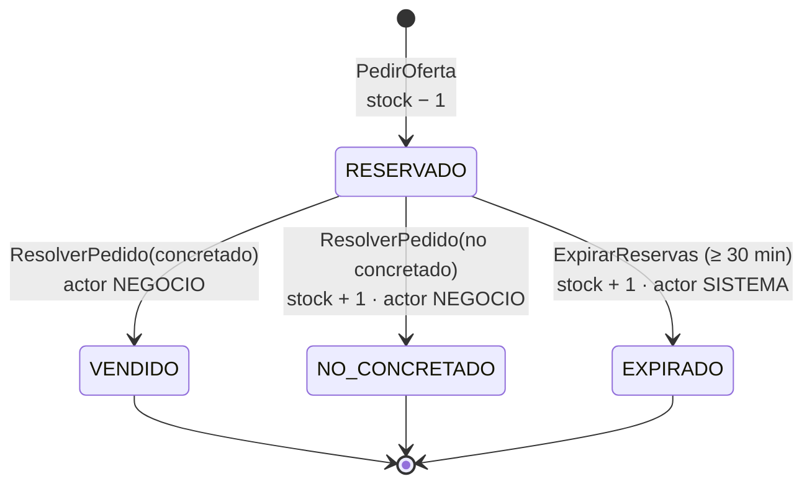
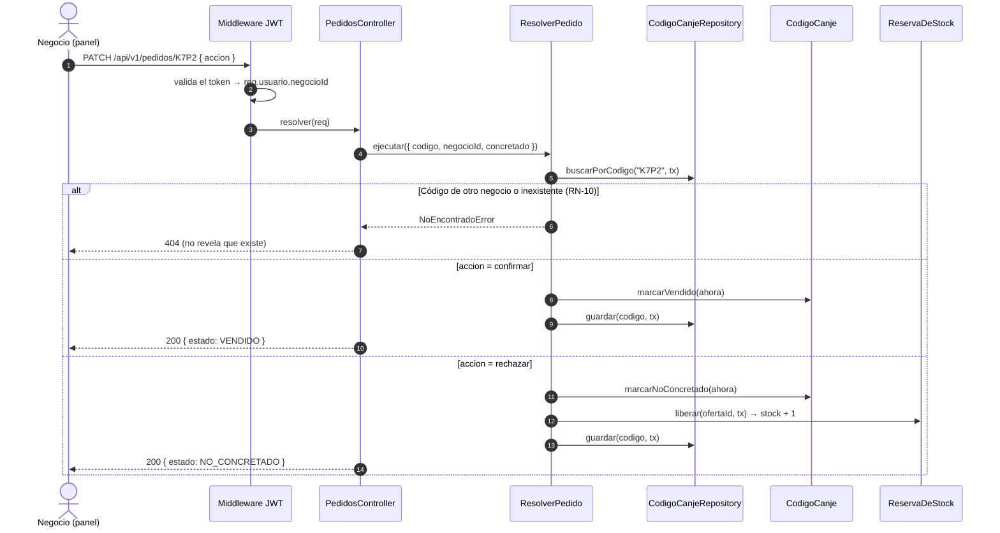
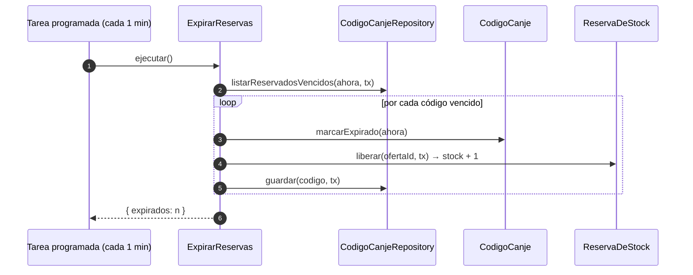

# Nivel 4 · Diagrama de código

> **Proyecto:** Marketplace de Ofertas de Cierre · **Módulos detallados:** Pedidos y Ofertas
> **Modelo:** C4 · Nivel 4 de 4 · **Notación:** UML · **Versión:** 1.0

---

## 1. Objetivo

Mostrar **cómo está organizado el código** de los componentes más críticos del nivel 3: sus clases, interfaces y cómo colaboran. Se detalla el ciclo completo de un **código de canje**: pedir, confirmar o rechazar, y expirar. Ese ciclo involucra a los módulos **Pedidos** y **Ofertas**.

| Aspecto | Descripción |
|---|---|
| Pregunta que responde | ¿Qué clases existen dentro de un módulo y cómo se relacionan? |
| Audiencia | Desarrolladores |
| Notación | UML: diagrama de clases, de secuencia y de estados |
| Por qué solo dos módulos | El nivel 4 es opcional en C4 y se dibuja solo para lo más complejo. Pedidos y Ofertas concentran DA01 (trazabilidad), DA02 (concurrencia) y DA03 (expiración) |
| Código ejecutable | [`tecnologia/ejemplo-clean-architecture/`](../../tecnologia/ejemplo-clean-architecture/README.md), con 15 pruebas que pasan |
| Nivel anterior | [`Nivel3-Diagrama-de-Componentes.md`](Nivel3-Diagrama-de-Componentes.md) |

---

## 2. Diagrama de clases: Pedidos ↔ Ofertas

**Lectura clave:** Pedidos **no conoce** `Oferta` ni `OfertaRepository`. Depende de su propio puerto `ReservaDeStock`, que un adaptador traduce a la fachada pública de Ofertas. Así cada módulo puede cambiar por dentro sin romper al otro (DA09).

> El diagrama de clases completo del módulo Pedidos (controlador, cinco puertos y sus adaptadores) está en [`diseno-interno-de-modulos.md`](../03-diseno-de-software/diseno-interno/diseno-interno-de-modulos.md#5-diagrama-de-clases).

---

## 3. Diagrama de estados: `CodigoCanje`

| Regla | Dónde se aplica |
|---|---|
| RN-06: la reserva vence a los 30 min | `CodigoCanje.reservar()` calcula `expiraEn`; `marcarExpirado()` lo verifica |
| RN-07: solo se sale de RESERVADO, una vez | Método privado `#transicion()` |
| RN-08: NO_CONCRETADO y EXPIRADO devuelven stock | Los casos de uso llaman a `ReservaDeStock.liberar()` en la misma transacción |
| AC07: trazabilidad | Cada transición agrega `{ estado, fecha, actor }` al historial |

---

## 4. Secuencia: el negocio confirma o rechaza un código

---

## 5. Secuencia: expiración automática

---

## 6. Clases del módulo Pedidos

| Clase | Tipo | Capa | Responsabilidad |
|---|---|---|---|
| `PedidosController` | Controlador | Presentación | Recibe `POST /ofertas/:id/pedidos` y `PATCH /pedidos/:codigo` |
| `PedirOferta` | Caso de uso | Aplicación | Reserva el stock, crea el código y arma el enlace en una transacción |
| `ResolverPedido` | Caso de uso | Aplicación | Confirma o rechaza un código del propio negocio |
| `ExpirarReservas` | Caso de uso | Aplicación | Expira las reservas vencidas y devuelve el stock |
| `CodigoCanje` | Entidad | Dominio | Máquina de estados del pedido, con historial |
| `EstadoCodigo` | Enumeración | Dominio | RESERVADO, VENDIDO, NO_CONCRETADO, EXPIRADO |
| `CodigoCanjeRepository` | Interfaz | Dominio | Contrato de persistencia de códigos |
| `ReservaDeStock` | Interfaz | Dominio | Lo que Pedidos necesita de Ofertas |
| `ContactoNegocio` | Interfaz | Dominio | Lo que Pedidos necesita de Negocios |
| `EnlaceMensajeria` | Interfaz | Dominio | Contrato para construir el enlace de chat |
| `GeneradorCodigo` | Interfaz | Dominio | Contrato para generar códigos cortos |
| `CodigoCanjeRepositoryMemoria` | Repositorio | Infraestructura | Implementación en memoria (el ejemplo y las pruebas) |
| `WaMeEnlaceAdapter` | Adaptador | Infraestructura | Implementa `EnlaceMensajeria` con `wa.me` |
| `GeneradorCodigoAleatorio` | Adaptador | Infraestructura | 4 caracteres sin ambigüedades (sin 0/O, 1/I/L) |
| `ReservaDeStockConOfertas` | Adaptador | Infraestructura | Traduce `ReservaDeStock` a la fachada de Ofertas |
| `ContactoNegocioConNegocios` | Adaptador | Infraestructura | Traduce `ContactoNegocio` a la fachada de Negocios |

## 7. Clases del módulo Ofertas (parte usada por Pedidos)

| Clase | Tipo | Capa | Responsabilidad |
|---|---|---|---|
| `Oferta` | Entidad | Dominio | RN-01 a RN-03 al publicar; RN-05 al reservar; RN-08 al liberar |
| `EstadoOferta` | Enumeración | Dominio | ACTIVA, PAUSADA, AGOTADA, FINALIZADA |
| `OfertaRepository` | Interfaz | Dominio | Obtener con bloqueo, guardar, listar vigentes |
| `OfertaRepositoryPg` | Repositorio | Infraestructura | PostgreSQL con `SELECT … FOR UPDATE` |
| `OfertaRepositoryMemoria` | Repositorio | Infraestructura | Implementación en memoria |
| `ListarOfertasVigentes` | Caso de uso | Aplicación | RF01: listado para la vitrina |
| `crearApiOfertas` (`index.js`) | Fachada | Módulo | API pública: `reservarUnidad`, `liberarUnidad` |
